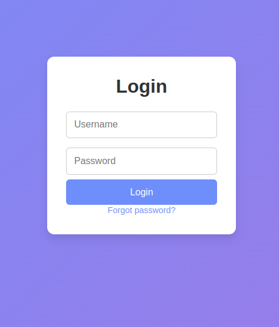
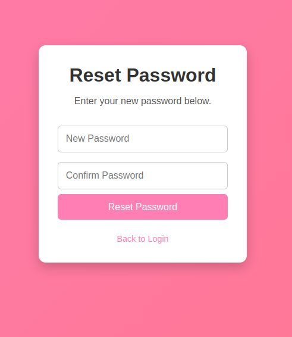

# Login & Forgot Password - HTML, CSS & JavaScript

Welcome to the repository for a **login** application with a **Forgot Password** functionality, built using **HTML**, **CSS**, and **JavaScript**.

This application allows users to log in and recover their password through a modern, user-friendly interface. It's a great example of how to build a basic authentication system for websites.

## 📦 Features

- **Login:** Allows users to log in using a username and password.
- **Forgot Password:** Lets users recover their forgotten password by providing their email address.
- **Responsive Design:** Adapts perfectly to both desktop and mobile devices.
- **Error Messages:** Provides visual feedback and error messages for incorrect login attempts.

## ⚙️ Technologies Used

- **HTML5** - For the page structure.
- **CSS3** - For styling the interface.
- **JavaScript** - For handling user interactions like login and password recovery.

## 📱 Screenshots

### Login Page


### Forgot Password Page


## 🚀 Getting Started

1. **Clone this repository**:
   ```bash
   git clone https://github.com/frrpetro/login-site.git
